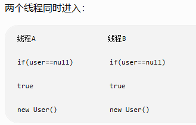

# 设计模式

## 分类

经典的设计模式一共23种，设计模式分为三大类

- 创建型
- 结构型
- 行为型

## 代理模式-结构型模式

因为刚好看到了代理模式，所以先整理这个，按部就班的学习太枯燥了

## 单例模式

构造器私有化，禁止外部创建对象

- 饿汉式
  - 类加载时就创建了对象,线程安全，创建的变量属于类，只会创建一次对象
  - 标准模板

    ```java
        public class InvocationInfoProxy {


            // 饿汉式单例
            private static InvocationInfoProxy cen =
                new InvocationInfoProxy();


            // 私有构造
            private InvocationInfoProxy(){}


            // 获取唯一对象
            public static InvocationInfoProxy getInstance(){

                return cen;

            }

        }
    ```

- 懒汉式
  - 需要的时候才创建对象，线程不安全，因为创建的变量属于对象，可能会多次创建
  - 
  - 标准模板
    ```java
    public class Singleton {
    
    
        private static Singleton instance;
    
    
        private Singleton(){}
    
    
        public static Singleton getInstance(){
    
            if(instance == null){
    
                instance = new Singleton();
    
            }
    
            return instance;
        }
    
    }
    ```
    
